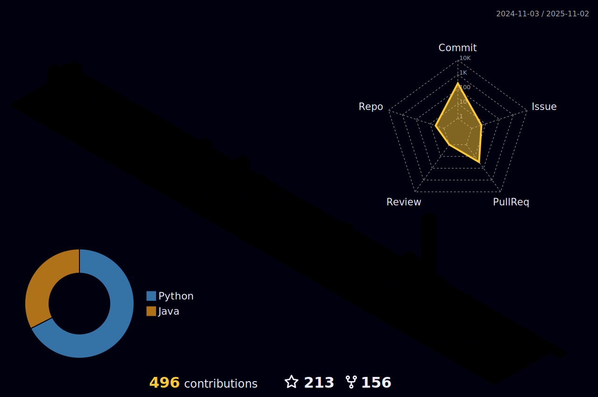

## Hi there 👋
<!--  -->

Here are some ideas to get you started:
- 🔭 I’m currently working on `Distributed Payment System` ...
- 🌱 I’m currently learning `Data Intensive Applicate Design` ...
- 👯 I’m looking to collaborate on open-source projects...
- 🤔 I’m looking for help with `Ideas`...
- 💬 Ask me about `Backend Engineering`...
- 📫 How to reach me:
>   
- 😄 Pronouns: ...
- ⚡ Fun fact: ...

<!-- 

    

  -->

